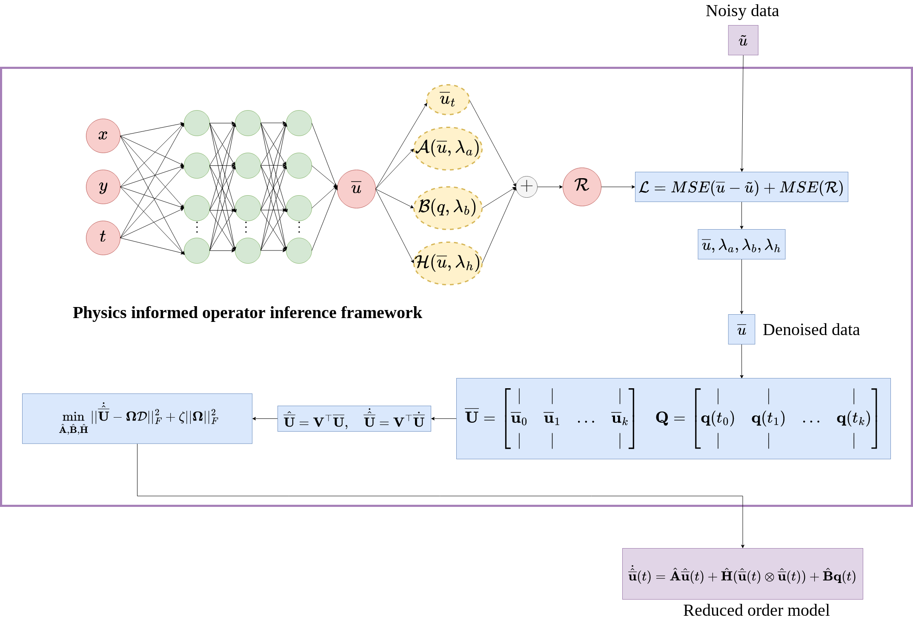

<p align="center">

</p>


## Physics informed operator inference framework
This repository contains codes for physics informed operator inference framework for noisy data. One dimensional examples of heat and burgers equations are presented here.


# Getting started
The first step is to install anaconda in your system
and create the conda enviroment necessary to run the above codes.

```
conda create env -f sciml_gpu.yaml
cond activate sciml_gpu
```

For the operator inference part, it is essential to install the library from [https://github.com/Willcox-Research-Group/rom-operator-inference-Python3](https://github.com/Willcox-Research-Group/rom-operator-inference-Python3). 

